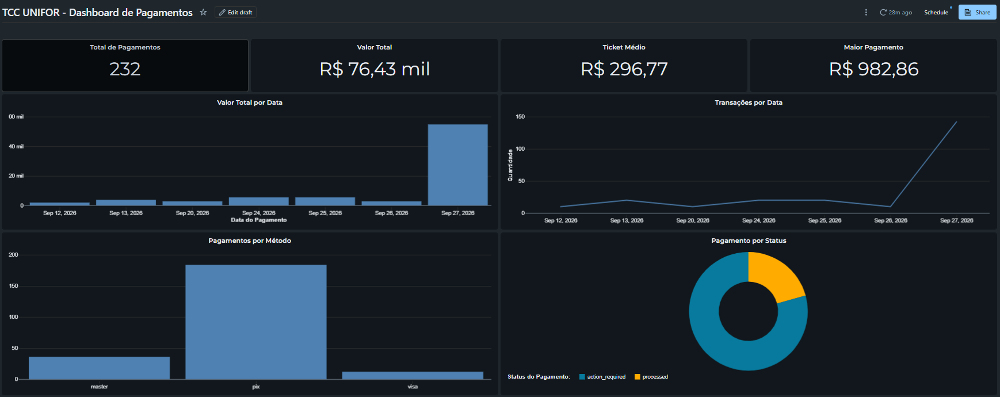
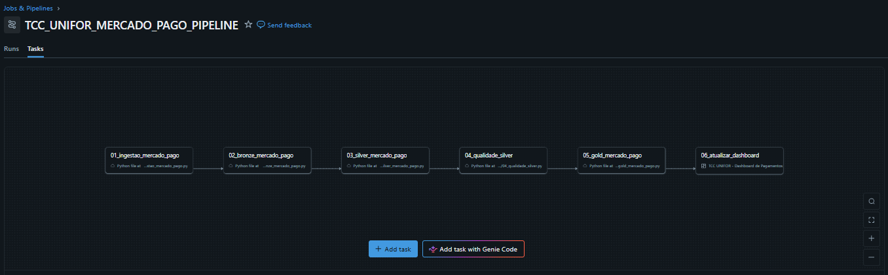
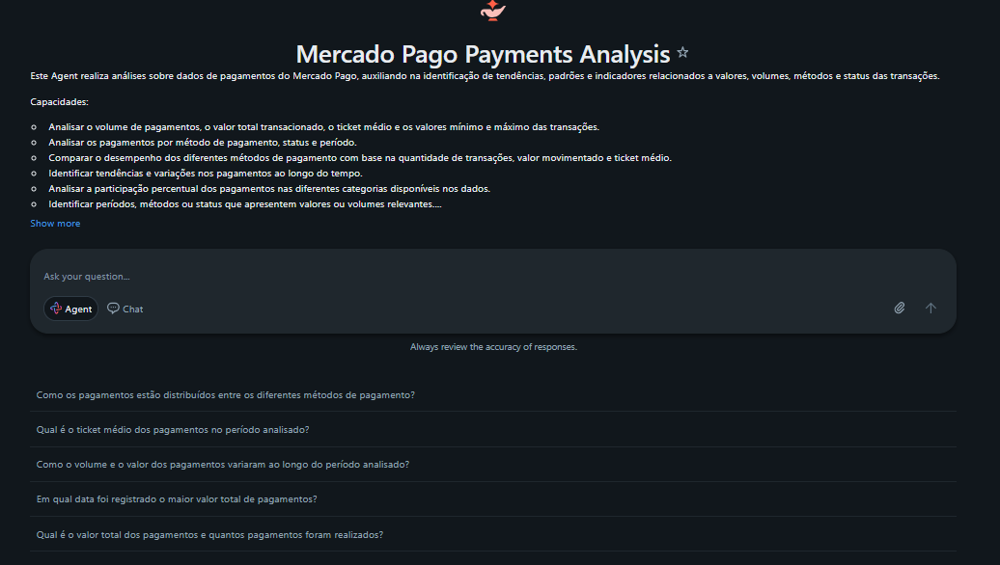

# Plataforma de Dados para Gestão Financeira de Pequenas Empresas

Projeto desenvolvido como Trabalho de Conclusão de Curso (TCC) da Universidade de Fortaleza (UNIFOR).

A solução propõe uma plataforma de Engenharia de Dados para centralizar e processar informações financeiras provenientes de meios de pagamento, utilizando o Mercado Pago como fonte de dados atualmente implementada. Os dados são ingeridos por uma API, processados no Databricks seguindo uma arquitetura Medallion e disponibilizados em uma camada analítica para consultas e visualização por meio de um dashboard.

---

## Sobre o projeto

Pequenas empresas podem utilizar diferentes meios para realizar vendas e receber pagamentos, como PIX e cartões. Nesse cenário, as informações financeiras podem ficar distribuídas entre diferentes sistemas, aplicativos e plataformas, dificultando a consolidação dos dados e a obtenção de uma visão única sobre os recebimentos.

Este projeto busca solucionar esse problema por meio da construção de uma plataforma de dados capaz de integrar informações de pagamentos, processar e padronizar esses dados e disponibilizá-los em uma camada centralizada para análise.

Na implementação atual, o **Mercado Pago** é utilizado como fonte de dados por meio de sua API. O fluxo de ingestão contempla transações de teste utilizando:

- PIX;
- cartão de crédito Mastercard;
- cartão de crédito Visa.

Os dados processados são armazenados em tabelas Delta no Databricks e utilizados para a construção de indicadores e visualizações.

---

## Problema

Quando uma empresa utiliza diferentes plataformas financeiras, cada uma pode possuir sua própria estrutura de dados, histórico de transações e forma de disponibilização das informações.

Essa fragmentação pode dificultar atividades como:

- acompanhar os recebimentos de forma consolidada;
- visualizar o volume financeiro total;
- comparar diferentes meios de pagamento;
- acompanhar a evolução das transações;
- identificar tendências nos dados;
- gerar indicadores financeiros;
- consultar rapidamente informações relevantes;
- utilizar os dados como apoio à tomada de decisão.

Além disso, a consolidação manual dessas informações pode exigir a utilização de planilhas e relatórios separados, aumentando a complexidade do processo.

---

## Solução proposta

A solução utiliza conceitos de Engenharia de Dados para construir um fluxo automatizado responsável por:

1. coletar os dados da API do Mercado Pago;
2. armazenar os dados brutos;
3. organizar os dados na camada Bronze;
4. tratar e padronizar os dados na camada Silver;
5. executar validações de qualidade;
6. consolidar os dados na camada Gold;
7. disponibilizar os dados para consultas e visualização em dashboard.

A arquitetura atualmente implementada pode ser representada pelo seguinte fluxo:

```text
              Mercado Pago API
                     │
                     ▼
              01 - Ingestão
                     │
                     ▼
               02 - Bronze
                     │
                     ▼
               03 - Silver
                     │
                     ▼
          04 - Qualidade Silver
                     │
                     ▼
                05 - Gold
                     │
                     ▼
          06 - Atualização do
               Dashboard
```

A execução dessas etapas é orquestrada por um **Databricks Job**, permitindo que o pipeline seja executado de forma sequencial e automatizada.

---

## Arquitetura de dados

O projeto utiliza uma arquitetura baseada no conceito de **Medallion Architecture**, separando o processamento dos dados em diferentes camadas.

### 🥉 Bronze

A camada Bronze é responsável pela entrada e persistência inicial dos dados provenientes da API do Mercado Pago.

Os dados brutos das orders são armazenados no ambiente do Databricks e posteriormente organizados em uma tabela Delta.

Processos:

```text
01_ingestao_mercado_pago.py
        ↓
02_bronze_mercado_pago.py
```

A etapa de ingestão realiza as requisições à API e salva os retornos em formato JSON. A etapa Bronze organiza esses dados e realiza a carga incremental na tabela:

```text
tcc_unifor.bronze.mercado_pago_orders
```

A utilização de uma camada Bronze permite manter os dados próximos de sua estrutura de origem e fornece uma base para as etapas posteriores de processamento.

---

### 🥈 Silver

A camada Silver é responsável pelo tratamento e padronização dos dados provenientes da Bronze.

O processo inclui a exploração das informações de pagamento presentes nas orders e a transformação dos dados para uma estrutura adequada às análises.

Processo:

```text
03_silver_mercado_pago.py
```

A tabela principal da camada Silver é:

```text
tcc_unifor.silver.mercado_pago_payments
```

Entre os tratamentos realizados estão:

- explosão dos pagamentos presentes nas orders;
- padronização dos nomes dos campos;
- conversão de tipos de dados;
- tratamento de valores monetários;
- conversão de datas e timestamps;
- organização das informações dos meios de pagamento;
- preparação dos dados para validação e consumo.

---

## Qualidade dos dados

Após o processamento da camada Silver, o pipeline possui uma etapa específica para validação da qualidade dos dados.

Processo:

```text
04_qualidade_silver.py
```

Essa etapa verifica se os dados processados atendem às regras e critérios definidos antes de serem disponibilizados para a camada Gold.

Entre as validações realizadas estão:

- campos obrigatórios não nulos;
- identificação de pagamentos duplicados;
- valores de pagamento válidos;
- consistência entre valor total e valor do pagamento;
- moeda utilizada;
- preenchimento das informações do meio de pagamento;
- consistência das datas;
- presença do timestamp de ingestão.

Caso sejam identificadas falhas críticas nas regras de qualidade, a execução do pipeline pode ser interrompida antes da carga da camada Gold.

---

## 🥇 Gold

A camada Gold representa os dados preparados para consumo analítico.

Processo:

```text
05_gold_mercado_pago.py
```

A tabela principal da camada Gold é:

```text
tcc_unifor.gold.mercado_pago_resumo
```

Nessa etapa são consolidados indicadores relacionados aos pagamentos, incluindo:

- quantidade de pagamentos;
- valor total;
- ticket médio;
- menor pagamento;
- maior pagamento;
- percentual de pagamentos;
- status do pagamento;
- método de pagamento;
- data de referência.

A Gold funciona como a principal camada de consumo analítico da solução e serve de origem para as consultas utilizadas no dashboard.

---

## Dashboard

A camada Gold alimenta um dashboard desenvolvido no **Databricks**.



O dashboard utilizado no projeto é:

```text
TCC UNIFOR - Dashboard de Pagamentos
```

O dashboard apresenta indicadores e visualizações relacionados aos dados processados, incluindo:

- total de pagamentos;
- valor total;
- ticket médio;
- maior pagamento;
- valor total por data;
- evolução diária dos pagamentos;
- pagamentos por status;
- pagamentos por método.

### Consultas SQL do dashboard

As consultas SQL utilizadas para construir os datasets e visualizações do dashboard estão versionadas no próprio projeto, na pasta:

```text
Dashboards/
└── SQL/
```

As consultas estão organizadas da seguinte forma:

```text
01_valor_total_por_data.sql
02_indicadores_gerais.sql
03_pagamentos_por_status.sql
04_pagamentos_por_metodo.sql
05_evolucao_diaria.sql
```

Essa organização permite manter separadas as consultas utilizadas na camada de visualização, facilitando a manutenção e o versionamento por meio do Git.

O dashboard utiliza como fonte a tabela:

```text
tcc_unifor.gold.mercado_pago_resumo
```

---

## Orquestração

A execução do pipeline é automatizada através de um **Databricks Job**.



Atualmente, o workflow possui seis etapas executadas sequencialmente:

```text
01_ingestao_mercado_pago
          │
          ▼
02_bronze_mercado_pago
          │
          ▼
03_silver_mercado_pago
          │
          ▼
04_qualidade_silver
          │
          ▼
05_gold_mercado_pago
          │
          ▼
06_atualizar_dashboard
```

Cada etapa possui dependência da execução bem-sucedida da etapa anterior.

A sexta etapa utiliza uma **Dashboard Task** do Databricks para atualizar o dashboard após a conclusão da camada Gold. Dessa forma, uma execução do Job percorre todo o fluxo, desde a obtenção dos dados no Mercado Pago até a atualização da visualização.

O Job também possui agendamento configurado no Databricks, permitindo a execução automática do pipeline.

---

## Databricks Asset Bundles

Além do código responsável pelo processamento dos dados, a configuração do workflow também é mantida como código.

O projeto utiliza **Databricks Asset Bundles** para versionar as configurações relacionadas à execução do pipeline.

O arquivo principal do Bundle é:

```text
databricks.yml
```

A configuração do Job está organizada na pasta:

```text
resources/
```

O arquivo de definição do Job contém as informações relacionadas a:

- nome do Job;
- agendamento;
- tarefas;
- dependências entre as tarefas;
- caminhos dos scripts Python;
- ambiente de execução;
- configuração de fila;
- atualização do dashboard;
- demais configurações do workflow.

A inclusão da configuração do Job no repositório permite que alterações na orquestração também sejam controladas e versionadas pelo Git.

---

## Estrutura do projeto

A estrutura principal do projeto está organizada da seguinte forma:

```text
TCC_UNIFOR/
│
├── databricks.yml
├── README.md
├── .gitignore
│
├── resources/
│   └── mercado_pago_job.yml
│
├── src/
│   ├── bronze/
│   │   ├── 01_ingestao_mercado_pago.py
│   │   └── 02_bronze_mercado_pago.py
│   │
│   ├── silver/
│   │   ├── 03_silver_mercado_pago.py
│   │   └── 04_qualidade_silver.py
│   │
│   └── gold/
│       └── 05_gold_mercado_pago.py
│
└── Dashboards/
    ├── README.md
    └── SQL/
        ├── 01_valor_total_por_data.sql
        ├── 02_indicadores_gerais.sql
        ├── 03_pagamentos_por_status.sql
        ├── 04_pagamentos_por_metodo.sql
        └── 05_evolucao_diaria.sql
```

> **Observação:** o dashboard é um recurso do ambiente Databricks. As consultas SQL utilizadas para sua construção estão mantidas e versionadas na pasta `Dashboards/SQL/`.

---

## Fluxo de processamento

O fluxo completo implementado segue as seguintes etapas:

```text
1. Mercado Pago API
          ↓
2. Ingestão
          ↓
3. Camada Bronze
          ↓
4. Camada Silver
          ↓
5. Validação de qualidade
          ↓
6. Camada Gold
          ↓
7. Atualização do Dashboard
          ↓
8. Visualização dos indicadores
```

Esse modelo permite separar claramente as responsabilidades de cada etapa do processamento e automatizar o caminho dos dados desde a fonte até o consumo analítico.

---

## Tecnologias utilizadas

Entre as principais tecnologias e conceitos utilizados no projeto estão:

- Databricks;
- Apache Spark;
- PySpark;
- Python;
- SQL;
- Delta Lake;
- Unity Catalog;
- Databricks Jobs;
- Databricks Asset Bundles;
- Git;
- GitHub;
- API do Mercado Pago;
- Arquitetura Medallion;
- Qualidade de Dados;
- Visualização de Dados;
- Engenharia de Dados.

---

## Versionamento

O projeto utiliza **Git e GitHub** para controle de versão.

O versionamento contempla:

- códigos responsáveis pela ingestão e processamento;
- configuração do Databricks Job;
- dependências e organização do workflow;
- consultas SQL utilizadas no dashboard;
- documentação do projeto.

A configuração do Job é mantida na pasta `resources`, enquanto as consultas SQL do dashboard são mantidas na pasta `Dashboards/SQL`.

Essa organização proporciona maior rastreabilidade das alterações realizadas durante a evolução do projeto.

---

## Inteligência Artificial

Além da visualização através de dashboards, o projeto prevê a utilização de Inteligência Artificial como uma possível forma adicional de interação com os dados.



A proposta é permitir que o usuário realize perguntas utilizando linguagem natural sobre os dados consolidados.

Exemplos:

```text
"Quanto recebi neste mês?"

"Qual foi o período com maior volume de pagamentos?"

"Como os recebimentos evoluíram nos últimos meses?"

"Qual meio de pagamento possui maior participação?"
```

Essa etapa representa uma possibilidade de evolução da solução, utilizando os dados consolidados pela plataforma para auxiliar na consulta e interpretação das informações.

---

## Evolução da solução

A arquitetura foi projetada para permitir a inclusão de novas fontes de dados.

Atualmente, o Mercado Pago representa a fonte de dados implementada. Futuramente, novas APIs e plataformas de pagamento poderão ser incorporadas mantendo o mesmo padrão arquitetural:

```text
Mercado Pago ──┐
               │
Fonte 2 ───────┼──► Plataforma de Dados ──► Gold ──► Dashboard
               │
Fonte 3 ───────┘
```

A expansão da solução poderá incluir novos meios de pagamento, novas fontes financeiras, indicadores adicionais e recursos de Inteligência Artificial.

---

## Contexto acadêmico

Projeto desenvolvido como parte do Trabalho de Conclusão de Curso (TCC) da **Universidade de Fortaleza (UNIFOR)**.

O trabalho busca aplicar conceitos de Engenharia de Dados em um problema de negócio, contemplando desde a ingestão e transformação dos dados até sua validação, consolidação e disponibilização para análise por meio de ferramentas de visualização.

## Conteúdos da pós-graduação aplicados no trabalho
- Introdução à Engenharia de Dados — construção e organização do pipeline de dados.
- Fundamentos de Banco de Dados e Modelagem — organização dos dados nas camadas Bronze, Silver e Gold.
- Linguagens de Programação para Engenharia de Dados — utilização de Python, SQL e PySpark.
- Ingestão Moderna de Dados — ingestão de dados por meio da API do Mercado Pago.
- Big Data e Tecnologias de Armazenamento — utilização de Delta Lake para armazenamento dos dados.
- A rquitetura de Data Lakehouse — aplicação da arquitetura Medallion no Databricks.
- Processamento Distribuído — utilização de Spark/PySpark nas transformações.
- Engenharia de Dados em Nuvem — utilização do Databricks como plataforma de processamento e armazenamento.
- Análise de Dados e Visualização — criação de consultas SQL e dashboard para análise dos pagamentos.
- DataOps e Observabilidade — orquestração do pipeline com Jobs, dependências entre tarefas e validações de qualidade.
- Governança, Segurança e Ética de Dados — utilização do Unity Catalog e armazenamento seguro do token da API.
- Data Products & Embedded Analytics — desenvolvimento do dashboard como produto para consumo dos dados.